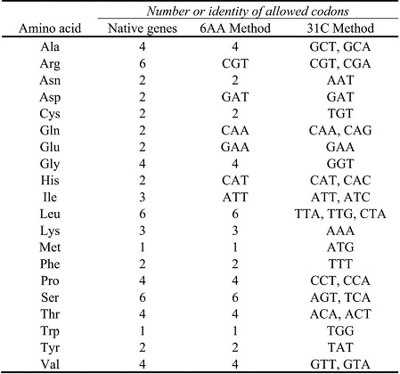
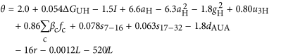

# codon_optimize.v2

## Codon optimization

Codon optimization toolkit offers several tools with a primary focus on gene coding sequence re-design. Specifically, this toolkit contains three major parts to re-design gene sequences by considering three different requirements:

### 1. DoE + Machine learning

This tool implements a new gene re-design strategy by using Design of Experiments (DoE) and machine learning.

DoE is a systematic method to help design experiments to express specific constructs. But these constructs are composed of characters (a, c ,t, g). They cannot be dealed with directly. So, we try to define some variables to convert these strings into numeric values, to represent each construct sequence. With these variables values and expression values, we can use some algorithms to build a function to link the variables with expression. After this good function or model is found, then we could use it to predict other constructs, just by converting new coding sequence into numeric values. Here, for different cases, the variables definition could be the same, but variables’ contributions often are different, and meanwhile, variables remained in the final model may also are different. 

This method mainly relies on the DoE data to help train the model to find this good function to link the variables and expression. To some degree, it also relies on prior knowledge, that is, variable definition. GC content and delta G in the N-terminal are often selected as variables. And in the process of model building, the variables would be filtered case by case. Only those proving to be effective will be remained. Consider it needs some data for training, this method is more specific. Each case needs to build a new model. But the framework are similar. 

### 2. N-terminal optimize

This tool calculates GC contents and minimum free energy (MFE) of N-terminal 6, 16 and 40 amino acids, since these two parameters both influence the translation. The output will contain all codon permutations and will be ranked according to the MFE (descending) and GC content (ascending) of N-terminal 16 amino acids. 

### 3. Preferred codon replace
            
This tool implements gene re-design methods "6AA" and "31C-FO". Codons used for synonymous gene design are shown as follows:

The essence of the design of synonymous sequences is that the native degeneracy of the genetic code is reduced to eliminate codons that correlate with reduced protein expression. In the 6AA approach, a single codon is used for 6 amino acids, while codons for the other 14 amino acids are not changed from the wild-type gene sequence. In the 31C-FO approach, the free energy is optimized using only the indicated subset of codons for each amino acid. These codons represent some kinds of “good” codons based on the more than 6000 proteins expression dataset in the E.coli. And the optimization method for 31C-FO is carried on in two steps: the sequence is divided into 2 parts, head (48 bp) and tail; for the head, it mainly considers the delta G of this head part plus 5’UTR. It tries to find the highest delta G within possible combinations; for the tail, it also computes delta G, but not to find the highest delta G. it tries to find delta G close to -10 kcal/mol. For more information, please refer to the reference below.

Above two approaches are relying on prior knowledge heavily. And therefore, they are more general methods, and could be applied to any target proteins that we hope to express in ecoli. But, they will also miss some important things. because the knowledge or experiences are learned from “majority” high expression proteins. Exceptions always exist. They won’t be effective for any protein or any case.

It also implements the calculation of codon influence metrics on mRNA expression, N-terminal minimum free energy, as well as back translation from protein sequence to DNA sequence.

### 4. Codon influence calculate

This tool mainly calculates codon-influence metrics that correlate strongly with global physiological protein concentrations and also mRNA concentrations and lifetimes in vivo. The logarithm of the odds of observing a high protein expression versus no expression could be given by

where delta GUH is the predicted free energy of folding of the head plus 5'-untranslated region (UTR), I is a binary indicator that is 1 only if delta GUH < -39 kcal mol-1 and the GC content of codons 2-6 is greater than 0.62, aH and gH are A and G frequencies in codons 2-6, u3H is the U frequency at the third position in codons 2-6, beta c and fc are the slopes and frequencies of each non-termination codon, s7-16 and s17-32 are the mean slopes for codons 7-16 and 17-32, dAUA is a binary variable that is 1 only if there is at least one AUA-AUA di-codon, r is the amino acid repetition rate and L is the DNA sequence length.

Accordingly, the probability is also given.

### 5. Minimum free engery calculate

This tool implements the calculation of N-terminal minimum free energy (MFE) of a large number of input sequences automatically.

### 6. Back translate

This tool is developed with the help of Epoch Life Science. It accepts a protein sequence as input and uses a codon usage table to generate a DNA sequence representing an optimized non-degenerate coding sequence.

### Reference
1) Goodman DB et al., Causes and effects of N-terminal codon bias in bacterial genes. Science (2013) 

2) Boël G et al, Codon influence on protein expression in E. coli correlates with mRNA levels. Nature (2016)
